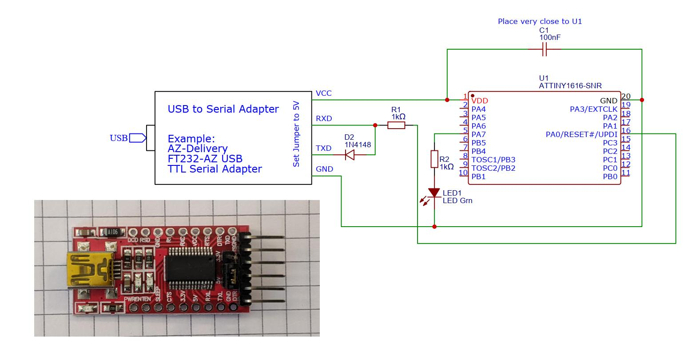

# ATtiny1616_with_Platformio_Serial-UPDI_Demo

## Description
This example of a blink sketch works with an ATtiny1616 processor.
A serial UPDI programmer is used.
The example works with PlatformIo and demonstrates the configuration of the serial programmer in the platformio.ini file.
 
## Prerequisites to run this project

### Software

- Current version of Platformio is installed.

- Programming software *pymcuprog* is installed. Installation instructions can be found in the [Platformio documentation.](https://docs.platformio.org/en/latest/platforms/atmelmegaavr.html#upload-using-pymcuprog-serialupdi). 


### Hardware
This example works with the hardware variants described here. 

#### Variant 1 - Use Breadboard


Set up an ATtiny1616 on a breadboard:



[Download link.](https://github.com/ajomay/ATtiny1616_with_Platformio_Serial-UPDI_Demo/tree/main/Hardware/BreadboardCircuit.jpg)

**Partlist:**

[ATtin1616 Mouser #556-ATTINY1616SNR](https://www.mouser.de/ProductDetail/Microchip-Technology/ATTINY1616-SNR?qs=HXFqYaX1Q2w711d4DTfCdw%3D%3D)

[Adapter SOP20 zu DIP20 1,27mm AMAZON](https://www.amazon.de/TSSOP20-Transfer-Adapter-TSSOP-20-SSOP-20/dp/B0C74Y8ZLK/ref=sr_1_8?crid=300ZQC9500VQ6&dib=eyJ2IjoiMSJ9.OM0KHObpSoN3tIzCgGoFp6HTVHn4S5AggmIbG0MeBrwdQJCkiLQ-_oJBvSpRY3EcekJ0ABd_p6Sn4IKZ82rWUg0AxYvt2-p_7DlH8s2AeWZnSKqUH3r7yj38yXNisfZ1aIIzDBOROrhCfCyOewWfr1jDu1-ElZanqL70JbITquy1Q64BkN1BpsKPiT5H6lkZwxoxekS492dartP0meOq9AtrXFN_8CMqfsBoXpC83Mm30Lis6Q6dGzkjE-cRSCe8O8jShqbatLsUDiN-dPb7lmaOkm3Dk8rmIw2buDnP5E0.8hEacro1iWInk9tU2EhQXxgdcX_JlG5qeM6EFJqoQ4I&dib_tag=se&keywords=sop20+adapter&qid=1716382191&sprefix=sop20%2Caps%2C102&sr=8-8)

[FT232-AZ USB to TTL Serial Adapter AZ-Delivery](https://www.az-delivery.de/products/ftdi-adapter-ft232rl)

This solution uses a commercially available USB-to-RS232 converter, which is converted into a UPDI programmer with a resistor and a diode.

The LED connected to the processor port *PA7* works as a *built-in* LED in the sense of the ARDUINO platform.


####  Variant 2 - Use DevBoard
A suitable example board is the [ATtiny x06/x16/x26 Development Board v2](https://github.com/wagiminator/AVR-Development-Boards/tree/master/ATtiny3216_DevBoard_v2)
by Stefan Wagner "wagiminator" on GitHub.


The board contains an integrated serial UPDI programmer, which can be activated by switching a slide switch to programming.

An LED on processor port PA7 functions as a built-in LED in the sense of the ARDUINO platform.

The schematic of the board is available and allows you to understand how to connect a UPDI serial programmer to an ATtiny1616 microprocessor.

**Attention: this example is designed for an ATtiny1616 processor. The development board shown used an ATtiny3216. The entry

```
board = ATtiny1616
```
in *platformio.ini* must be changed accordingly.

